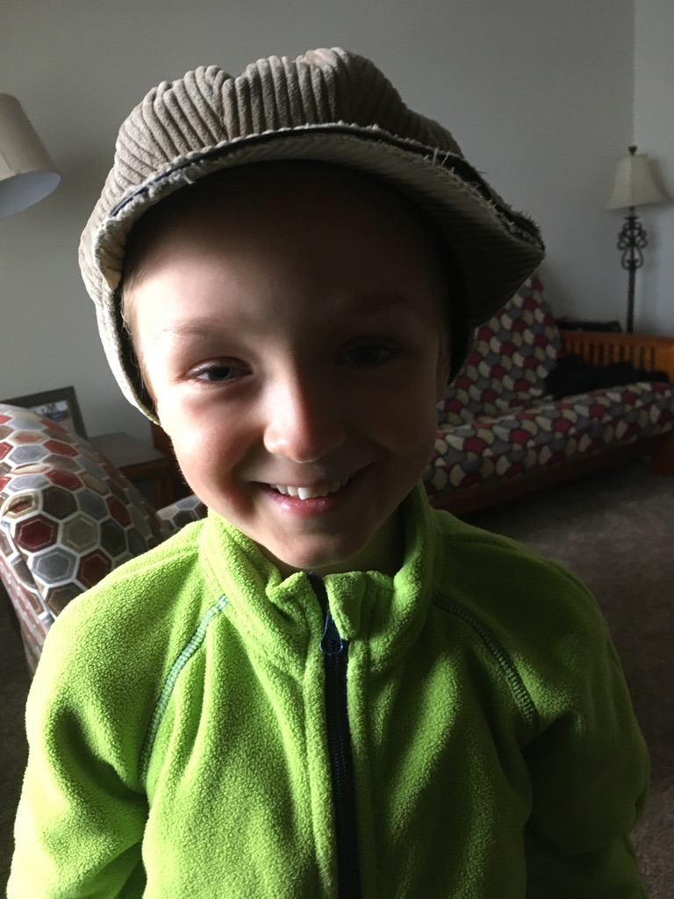

# LAB - Class 17 | AWS

## Project: S3 and Lambda

## Feature Tasks

- A user should be able to upload an image at any size, and have both the original size and a thumbnail size.
- When an image is uploaded to your S3 bucket, it should trigger a Lambda function that does the following:
  - creates a 50 x 50 pixel thumbnail version of the image;
  - saves it to another S3 bucket with a predictable naming convention, so that your server and/or frontend may know where that thumbnail image resides.

## Details

### How to use this lambda

- Add a .jpg to the source bucket in the S3 dashboard of AWS.
- Open the target bucket to verify the presence and size of the resized photo. (One may also download the resized photo after clicking on its link and choosing download from the dropdown under "object actions.")
- View the logs for verification of a successful resizing.

### Issues encountered during deployment of this lambda

- No issues to speak of: the tutorial was very thorough.
- I'd not at this point be able to repeat this activity without the tutorial, nor do I know yet how to implement this service into a project.

### The image and thumbnail that this Lambda processed

### Author: Nathan Cox

### Contributors

- Classmates: Simon Panek, Mariko Alvarado
- Code Fellows TAs: N/A

### Links and Resources

- [CI/CD]()
- [Front-end Application]()
<!-- - [Back-end Server URL](http://xyz.com) (when applicable) -->
- [AWS Tutorial: Using AWS Lambda with Amazon S3](https://docs.aws.amazon.com/lambda/latest/dg/with-s3-example.html)

### Setup

#### .env requirements (where applicable)

#### How to initialize/run your application (where applicable)

#### How to use your library (where applicable)

#### Tests

- How do you run tests?:
- Any tests of note?:
- Describe any tests that you did not complete, that skipped, and etc:

#### UML
